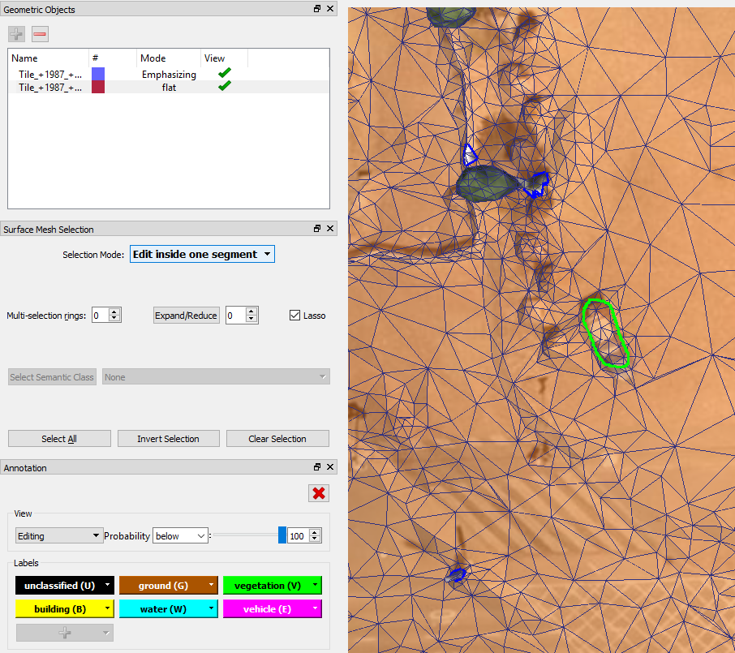

Urban Mesh Annotator Tutorial {.auto-style7}
-----------------------------

### **1. Annotation Pipeline** {.auto-style7}

+--------------------------------------+--------------------------------------+
| \                                    | ***\                                 |
|                | Step 1: Load the \*.ply mesh data\   |
|                                      | \                                    |
|                                      | ***                                  |
|                                      |           |
+--------------------------------------+--------------------------------------+
| \                                    | ***\                                 |
|   \           | Step 2: Segment selection and        |
|     +\                               | deselection***\                      |
|  \             |  Perform selection and deselection   |
|    or\                               | at segment level. Hint: select the   |
|  \            | segment with incorrect label (or     |
|                                      | color).                              |
|                                      | -   Perform selection by holding on  |
|                                      |     **Shift** and clicking (can with |
|                                      |     dragging) the **Mouse Left**     |
|                                      |     **Button**.                      |
|                                      | -   Perform deselection .by holding  |
|                                      |     on **Shift** and clicking (can   |
|                                      |     with dragging) the **Mouse       |
|                                      |     Right** **Button**.              |
|                                      |                                      |
|                                      |            |
|                                      | Before selection                     |
|                                      |            |
|                                      | After selection (show in red)        |
+--------------------------------------+--------------------------------------+
| \                                    | \                                    |
|   \           |  ***Step 3: Add semantic labels***\  |
|  +\                                  |  Simply click the label button in    |
|  Label capital letter                | the annotation panel for the         |
|                                      | selected area or \                   |
|                                      | press **Shift** and (first letter of |
|                                      | a label) to assign the new label     |
|                                      | (e.g., Shift + G for adding to       |
|                                      | ‘ground’).\                          |
|                                      |  Note: If you are not sure which     |
|                                      | label to assign, you could assign    |
|                                      | the selected area with the           |
|                                      | 'unclassified' label.\               |
|                                      |  \                                   |
|                                      |                                      |
|                                      | \  |
|                                      |  \                                   |
+--------------------------------------+--------------------------------------+
|                                      | \                                    |
|                                      |  ***Step 4: Edit inside one          |
|                                      | segment***\                          |
|                                      |  If the segment contain other        |
|                                      | objects, you should change to 'Edit  |
|                                      | inside one segment' mode. The mouse  |
|                                      | hovering area will be \              |
|                                      |  highlighted. Hold on the **Shift**  |
|                                      | and **Mouse Left Button** for        |
|                                      | selecting the segment you want to    |
|                                      | edit at the facet level. \           |
|                                      |  \                                   |
|                                      |                                      |
|                                      |                       |
|                                      | \                                    |
|                                      |  \                                   |
|                                      | Select triangle facets by holding on |
|                                      | **Shift** and clicking **Mouse Left  |
|                                      | Button** or draw with 'Lasso', then  |
|                                      | assign a new label to the selected\  |
|                                      |  area. After finishing the editing,  |
|                                      | do not forget to switch back to the  |
|                                      | 'Select segments' mode.\             |
|                                      |  \                                   |
|                                      |        |
|                                      | Lasso selection                      |
|                                      |       |
|                                      | Assign the new label                 |
+--------------------------------------+--------------------------------------+
|  \             | ***Step 5: Save the current work***\ |
|  +\                                  |  Save the current work by pressing   |
|  **S**                               | CTRL + S or click the  'Save as'     |
|                                      | under the menu 'file'.               |
+--------------------------------------+--------------------------------------+

### 2. Selection Panel Instruction {.auto-style7}

\

-   **Selection mode:**Activate 'Select segments' mode for selecting at
    the segment level, activate 'Edit inside one segment' mode for
    selecting \
     at the triangle facet level.
-   **Multi-selection rings:** It's only valid in 'Edit inside one
    segment' mode. The number of rings decides the size of the selected
    area.
-   **Expand/Reduce:** Click 'Expand / Reduce' or '**Mouse wheel**
    forward / backward' with certain number of rings to exapnd or reduce
    from the\
     current selected area.
-   **Lasso:** It's only valid in 'Edit inside one segment' mode.
    Holding on **Shift** and**Mouse Left Buton / Mouse Right Button** to
    select / deselect the \
     area with your drawing.
-   **Select Segment Class:** Select one semantic label from the combo
    box. The area with the selected label will be highlighted. Then
    click \
     'Select Semantic Class' to confirm the selection.
-   **Select All:** Select all segments in 'Select Segments' mode or
    select all triangle facet within a segment in 'Edit inside one
    segment' mode.
-   **Inver Selection:** Invert select all segments in 'Select Segments'
    mode or invert select all triangle facet within a segment in \
    'Edit inside one segment' mode.
-   **Clear Selection:** Clear all selected segments in 'Select
    Segments' mode or clear all selected triangle facet within a segment
    in \
    'Edit inside one segment' mode.

\

### 3. Annotation Panel Instruction {.auto-style7}

+--------------------------------------------------------------------------+
| \                                                                        |
|                                        |
| -   **View:**In the combo box of the view, the 'Real colors' shows the   |
|     original facet color of the input mesh; the 'Editing' view shows the |
|     current labeling \                                                   |
|      view; the remaining views present the view only with the selected   |
|     semantic labels, the unselected labels will show in white color.     |
| -   **Probability slider:** It will be valid only when the input data    |
|     has the probability value of each facet. It can present the semantic |
|     facet with the label \                                               |
|      color above/below a threshold value.                                |
| -   **Progress bar:** IIt replaces the 'Probability slider' when the     |
|     input data has the probability value of each facet. It can show the  |
|     current labeling \                                                   |
|      progress.                                                           |
|                                            |
| -   **Label panel:** The input mesh decides the label and associate      |
|     color, the user cannot change it. By pressing the label button or    |
|     use short cuts \                                                     |
|      **Shift**+ Label capital letter to assign label to the selected     |
|     area.                                                                |
+--------------------------------------------------------------------------+

### 4. Context Menu {.auto-style7}

+--------------------------------------------------------------------------+
| \                                                                        |
|                                            |
| -   **Set flat Mode:**Set the current rendering mode with facet semantic |
|     color only.                                                          |
| -   **Set TextureMode Mode:** Set the current rendering mode with        |
|     texture only.                                                        |
| -   **Set TextureMode+flat+edges Mode:** Set the current rendering mode  |
|     with texture and semantic color together.                            |
| -   **Alpha value:** Tune the transparency between texture and texture   |
|     with semantic color.                                                 |
| -   **Display Triangle Edges:** display the triangle facet edges.        |
| -   **Display Segment Border:** display the segment border.              |
| -   **Zoom to Index:** zoom the view to the entered vertex/edge/facet    |
|     index.                                                               |
| -   **Statistics:** show the statistics of the input mesh (To do: add    |
|     semantic statistics).                                                |
| -   **Reload Item from File:** Reload the input mesh from file.          |
| -   **Save as:** Save the current labeling work in a \*ply file.         |
| -   **Zoom to this object:** zoom to the current scene or selected       |
|     area.\                                                               |
+--------------------------------------------------------------------------+

