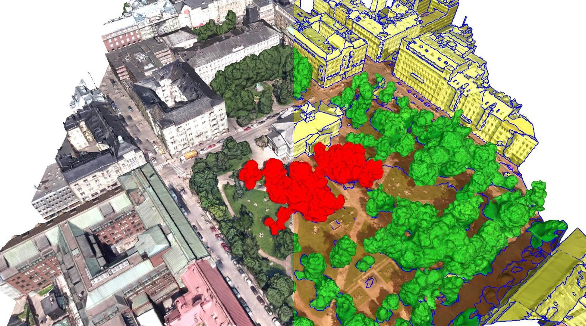

# Urban Mesh Annotation Tool

Mesh annotation tool for labelling urban scenes. 
Before you import your model, please check your input mesh is in ascii *.ply format.
Note that non-manifold meshes are not supported in this tool. 
If you still want to use it, please use [MeshLab](https://www.meshlab.net/) to repair it first.
For more information, please visit our [project website](https://3d.bk.tudelft.nl/projects/meshannotation/).

    

## Citation

If you use it in a scientific work, we kindly ask you to cite it:

<strong> SUM: A Benchmark Dataset of Semantic Urban Meshes </strong>. Weixiao Gao, Liangliang Nan, Bas Boom and Hugo Ledoux. <em> ISPRS Journal of Photogrammetry and Remote Sensing</em> 179 (2021) 108-120.  <a href="https://www.sciencedirect.com/science/article/pii/S0924271621001854"><i class="fas fa-external-link-alt"></i> PDF</a> <a href="#myref" data-toggle="collapse"><i class="fas fa-caret-square-down"></i> BibTeX</a> 
<pre class="bibtex">@article{sum2021,
author = {Weixiao Gao and Liangliang Nan and Bas Boom and Hugo Ledoux},
title = {SUM: A Benchmark Dataset of Semantic Urban Meshes},
journal = {ISPRS Journal of Photogrammetry and Remote Sensing},
volume = {179},
pages = {108-120},
year={2021},
issn = {0924-2716},
doi = {10.1016/j.isprsjprs.2021.07.008},
url = {https://www.sciencedirect.com/science/article/pii/S0924271621001854},
}
</pre>

 
## Build from source
### Windows with CMake 

  1. Install Eigen and Qt(>5.6)
  1. a modified version of CGAL is provided (folder `./CGAL/`), use it in CMake. 
  1. `cd src`
  1. `mkdir build && cd build`
  1. `cmake -DCMAKE_BUILD_TYPE=Release ..` to compile in release mode and not debug
  1. `make`
  1. `./UrbanMeshAnnotator`

### macOS with CMake 

  1. `brew instal eigen`
  1. `brew install qt5`
  1. a modified version of CGAL is used (folder `./CGAL/`), and you need to use that one: `export CGAL_DIR=/path/to/CGAL_FOLDER` 
  1. `cd src`
  1. `mkdir build && cd build`
  1. `cmake -DCMAKE_BUILD_TYPE=Release ..` to compile in release mode and not debug
  1. `make`
  1. `./UrbanMeshAnnotator`

## How to annotate data

See the instruction in Tutorial.md

# Main entry point  
	UrbanMeshAnnotator main.cpp  
  
# Required Plugins  
	classification_plugin  
	selection_plugin  
	ply_plugin  
  
# Required libraries:  
	Qt5.9  
	Eigen  
	Boost  
  
# Required sub-modules:  
	QT:  
		Qt5Core  
		Qt5OpenGL  
		Qt5Svg    
		Qt5Widgets  
		Qt5Gui  
		Qt5Xml  
		Qt5Script  
		imageformats/qjpeg  
		platforms/qwindows  
  
