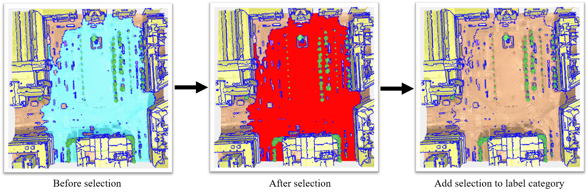
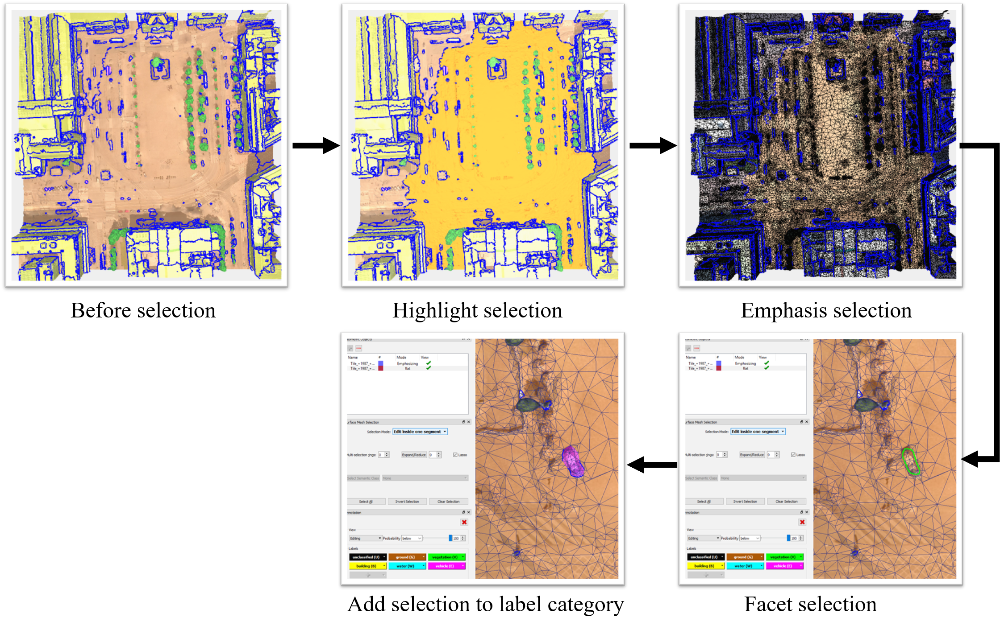
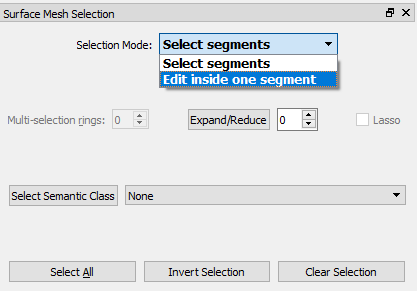
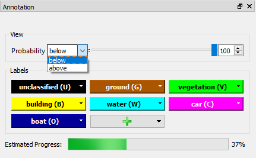
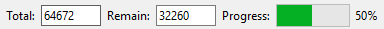
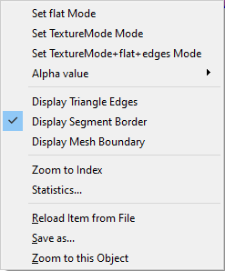

# Urban-Mesh-Annotator-Manual
## 1. Annotation Pipeline
### Step 1: Load  the *.ply mesh data.

### Step 2.1: Segment annotation.

- Perform selection **(Shift+Left)** and deselection **(Shift+Right)** at segment level. 
- Select the segment with incorrect label (or color).
- Adds selection to the label category (**Shift+<u>Capital Letter</u>** ). 

### Step 2.2: Triangle Facet Annotation.

- Change 'Selection Mode' to ***Edit inside one segment***, then use **(Shift+Left)** 
 to select the highlighted one. 
- Use ***Lasso*** or **(Shift+Left)** to draw and follow the object boundary as much as possible. 
- Adds selection to the label category (**Shift+<u>Capital Letter</u>** ). 

### Step 3: Save your work.

## 2. Useful Shortcuts
* **Note :** For shortcuts on macOS, '**Ctrl**' is replaced by '**Command**'.
### 2.1 Basics
| Shortcuts                    |     Descriptions         |
| -----------------------      | ---------------------    |
| H                            | Help menu.               |
| Left Button                  | Rotates camera.          |
| Left Button Double Click     | Aligns camera.           |
| Right Button                 | Translates camera.       |
| Right Button Double Click    | Centers scene            |
| Wheel                        | Zooms camera.            |
| Middle Button Double Click   | Shows entire scene.      |
| Alt+Left                     | Shows context menu.      |

### 2.2 Load and Save Files
| Shortcuts               |     Descriptions                                |
| ----------------------- | ---------------------                           |
| Ctrl+S                  | Save as.                                        |
| Ctrl+F1                 | Save snapshot with camera parameters (*.txt).   |
| Ctrl+F2                 | Load camera parameters(*.txt) and show the view.|

### 2.3 View Operations
| Shortcuts     |     Descriptions         |
| --------------| ---------------------    |
| Ctrl+R        | Recenter Scene.          |
| Ctrl+Left     | Sets pivot point.        |
| Ctrl+1        | Toggles the texture.     |
| Ctrl+2        | Toggles the face color.  |
| Z+Left        | Zooms on pixel.          |
| Z+Right       | Zooms to fit scene.      |

### 2.4 Selection Operations
| Shortcuts                      |     Descriptions                     |
| --------------                 | ---------------------                |
| Shift+Left                     |Selection.                            |
| Shift+Right                    |Deselection.                          |
| Shift+Wheel                    |Expand/Reduce selection.              |
| Shift+(<u>Capital Letter</u>)  |Adds selection to the label category. |

## 3. Selection Panel Instruction

* **Selection mode:** Activate 'Select segments' mode for selecting at the segment level, activate 'Edit inside one segment' mode for selecting
at the triangle facet level.
* **Multi-selection rings:** It's only valid in 'Edit inside one segment' mode. The number of rings decides the size of the selected area.
* **Expand/Reduce:** Click 'Expand / Reduce' or 'Mouse wheel forward / backward' with certain number of rings to exapnd or reduce from the
current selected area.
* **Lasso:** It's only valid in 'Edit inside one segment' mode. Holding on Shift and Mouse Left Buton / Mouse Right Button to select / deselect the
area with your drawing.
* **Select Segment Class:** Select one semantic label from the combo box. The area with the selected label will be highlighted. Then click
'Select Semantic Class' to confirm the selection.
* **Select All:** Select all segments in 'Select Segments' mode or select all triangle facet within a segment in 'Edit inside one segment' mode.
* **Inver Selection:** Invert select all segments in 'Select Segments' mode or invert select all triangle facet within a segment in
'Edit inside one segment' mode.
* **Clear Selection:** Clear all selected segments in 'Select Segments' mode or clear all selected triangle facet within a segment in
'Edit inside one segment' mode

## 4. Annotation Panel Instruction

* **Label panel:** The input mesh decides the label and associate color, the user cannot change it. By pressing the label button or use short cuts
Shift + Label capital letter to assign label to the selected area.
* **Progress bar:** IIt replaces the 'Probability slider' when the input data has the probability value of each facet. It can show the current labeling
progress.

## 5. Context Menu

* **Set flat Mode:** Set the current rendering mode with facet semantic color only.
* **Set TextureMode Mode:** Set the current rendering mode with texture only.
* **Set TextureMode+flat+edges Mode:** Set the current rendering mode with texture and semantic color together.
* **Alpha value:** Tune the transparency between texture and texture with semantic color.
* **Display Triangle Edges:** display the triangle facet edges.
* **Display Segment Border:** display the segment border.
* **Zoom to Index:** zoom the view to the entered vertex/edge/facet index.
* **Statistics:** show the statistics of the input mesh (To do: add semantic statistics).
* **Reload Item from File:** Reload the input mesh from file.
* **Save as:** Save the current labeling work in a *ply file.
* **Zoom to this object:** zoom to the current scene or selected area.
