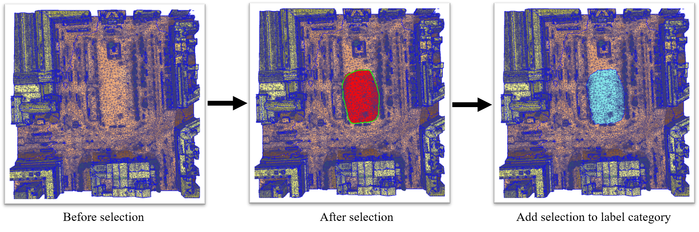
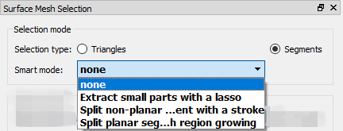
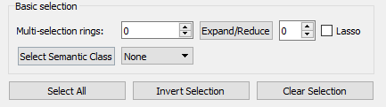
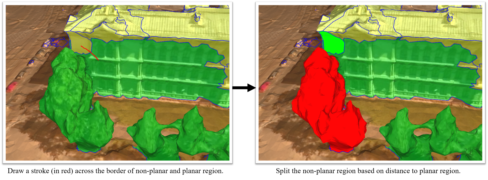
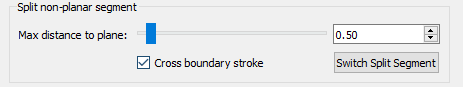
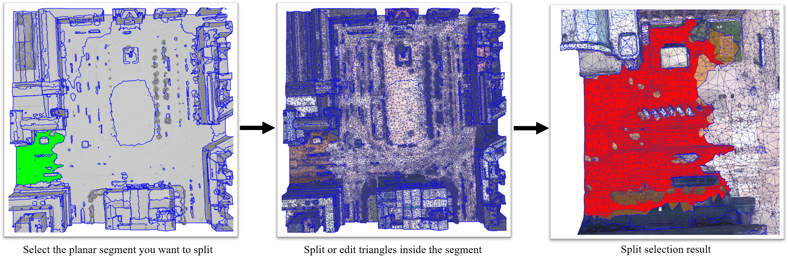
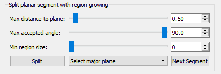

# Urban-Mesh-Annotator-Manual
## 1. Annotation pipeline
The annotation consists of two main steps: **Selecting elements** and **Labeling**.
- Firstly, load  the *.ply mesh data.
- The elements in ***Selection*** consists of ***segments*** (a group of connected triangle faces) 
and ***triangle faces***. 
- The label **<u>Letters</u>** of **Labeling** include: 
***Unclassified*** **(U)**, 
***Ground*** **(G)**, 
***Vegetation*** **(V)**, 
***Building*** **(B)**,
***Water*** **(W)**,
 and ***Vehicle*** **(E)**.
- Finally, press **(Ctrl+S)** to save your work.

### (1) Segment annotation: 

- Click ***'Segments'*** radio buttion.
- Perform selection **(Shift+Left)** and deselection **(Shift+Right)**. 
- Select the segment with incorrect semantic label.
- Adds selection to the label category (**Shift + <u>Letters</u>** ).

### (2) Triangle facets annotation:

- Click ***'Triangles'*** radio buttion.  
- Press **(Shift+Left)** to select or use ***Lasso*** to draw and follow the object boundary as much as possible. 
- Adds selection to the label category (**Shift + <u>Letters</u>** ). 

## 2. Useful Shortcuts
* **Note :** For shortcuts on macOS, '**Ctrl**' is replaced by '**Command**'.
### 2.1 Basics
| Shortcuts                    |     Descriptions         |
| -----------------------      | ---------------------    |
| H                            | Help menu.               |
| Left Button                  | Rotates camera.          |
| Left Button Double Click     | Aligns camera.           |
| Right Button                 | Translates camera.       |
| Right Button Double Click    | Centers scene            |
| Wheel                        | Zooms camera.            |
| Middle Button Double Click   | Shows entire scene.      |
| Alt+Right                    | Shows context menu.      |

### 2.2 Load and Save Files
| Shortcuts               |     Descriptions                                |
| ----------------------- | ---------------------                           |
| Ctrl+S                  | Save as.                                        |
| Ctrl+F1                 | Save snapshot with camera parameters (*.txt).   |
| Ctrl+F2                 | Load camera parameters(*.txt) and show the view.|

### 2.3 View Operations
| Shortcuts     |     Descriptions         |
| --------------| ---------------------    |
| Ctrl+R        | Recenter Scene.          |
| Ctrl+Left     | Sets pivot point.        |
| Ctrl+1        | Toggles the texture.     |
| Ctrl+2        | Toggles the face color.  |
| Z+Left        | Zooms on pixel.          |
| Z+Right       | Zooms to fit scene.      |

### 2.4 Selection Operations
| Shortcuts                      |     Descriptions                     |
| --------------                 | ---------------------                |
| Shift+Left                     |Selection.                            |
| Shift+Right                    |Deselection.                          |
| Shift+Wheel                    |Expand/Reduce selection.              |
| Shift+(<u>Capital Letter</u>)  |Adds selection to the label category. |
| Alt+S                          |Split planar segment.                 |

## 3. Selection Panel Instruction
#### 3.1 Selection Mode

* **Selection type:** Click the 'Triangles' radio button for selecting at the triangle level; click the 'Segments' radio button for selecting at the segment level.

* **Smart mode:** There are three smart modes: 'Extract small parts with a lasso', 'Split non-planar segment with a stroke', and 'Split planar segment with region growing'. They can recommend some selection regions for the user to use.

#### 3.2 Selection Basics

* **Multi-selection rings:** The number of rings decides the size of the selected area.
* **Expand/Reduce:** Click 'Expand / Reduce' or 'Mouse wheel forward / backward' with certain number of rings to exapnd or reduce from the
current selected area.
* **Lasso:** Holding on Shift and Mouse Left Buton / Mouse Right Button to select / deselect the area with your drawing (show in green).
* **Select Semantic Class:** It's only valid in 'Select segments'. Select one semantic label from the combo box. The area with the selected label will be highlighted. Then click
'Select Semantic Class' to confirm the selection.
* **Select All:** Select all segments in 'Select Segments' mode or select all triangle facet within a segment in 'Split planar segment with region growing' or 'Split non-planar segment with a stroke' mode.
* **Inver Selection:** Invert select all segments in 'Select Segments' mode or invert select all triangle facet within a segment in
'Split planar segment with region growing' or 'Split non-planar segment with a stroke' mode.
* **Clear Selection:** Clear all selected segments in 'Select Segments' mode or clear all selected triangle facet within a segment in
'Split planar segment with region growing' or 'Split non-planar segment with a stroke' mode.

#### 3.3 Smart Modes

##### 3.3.1 Split non-planar segment with a stroke

Consider the **non-planar segment** that can be fitted with mutple planes given a small distance to the plane threshold.

* **Max distance to plane:** The maximum distance from a point to a plane.
* **Cross boundary stroke:** Draw a stroke (show in red) cross a boundary between the planar segment and the non-planar segment. If the stroke it not checked, then the basic selection is activated.
* **Switch split segment:** Switch the selected planar and non-planar segment.

##### 3.3.2 Extract major planar region within a segment

Consider the **planar segment** that can be fitted with one large plane (i.e. occupy most of area of a segment) given a small distance to the plane threshold (e.g. 0.5m).

* **Max distance to plane:** The maximum distance from a point to a plane.
* **Max accepted angle:** The maximum accepted angle between the normal associated with a point and the normal of a plane.
* **Min region size:** The minimum number of points a region must have.
* **K neighbors:** K nearest neighbors of the query point.  It's only valid when input mesh has duplicate vertices (e.g. a mesh merged from multiple tiles).
* **Split:** Split the selected segment into 'main plane' and 'all parts' according to the input parameters. 
* **Select main plane/all parts:** After split, select 'main plane' or 'all parts' of a segment.
* **Next Segment:** Select the next segment to edit. 

##### 3.3.3 Split mesh with region growing

Consider the mesh that can be fitted with mutiple large planes given a small distance to the plane threshold (e.g. 0.5m).

* **Max distance to plane:** The maximum distance from a point to a plane.
* **Max accepted angle:** The maximum accepted angle between the normal associated with a point and the normal of a plane.
* **Min region size:** The minimum number of points a region must have.
* **K neighbors:** K nearest neighbors of the query point.  It's only valid when input mesh has duplicate vertices (e.g. a mesh merged from multiple tiles).
* **Split:** Split the selected segment into 'main plane' and 'all parts' according to the input parameters. 
* **Clear segments:** Clear all segments. 

## 4. Annotation Panel Instruction

* **Label panel:** The input mesh decides the label and associate color, the user cannot change it. By pressing the label button or use short cuts
Shift + Label capital letter to assign label to the selected area.
* **Probability slider:** It is used for the user to check the areas that are most likely misclassified. The semantic colour is shown when the region's probability above or below the threshold, and other areas are shown in white colour.
* **Progress bar:** It shows the rough labeling progress according to the pre-computed probability.

## 5. Context Menu

* **Set flat Mode:** Set the current rendering mode with facet semantic color only.
* **Set TextureMode Mode:** Set the current rendering mode with texture only.
* **Set TextureMode+flat+edges Mode:** Set the current rendering mode with texture and semantic color together.
* **Alpha value:** Tune the transparency between texture and texture with semantic color.
* **Display Triangle Edges:** display the triangle facet edges.
* **Display Segment Border:** display the segment border.
* **Zoom to Index:** zoom the view to the entered vertex/edge/facet index.
* **Statistics:** show the statistics of the input mesh (To do: add semantic statistics).
* **Reload Item from File:** Reload the input mesh from file.
* **Save as:** Save the current labeling work in a *ply file.
* **Zoom to this object:** zoom to the current scene or selected area.
